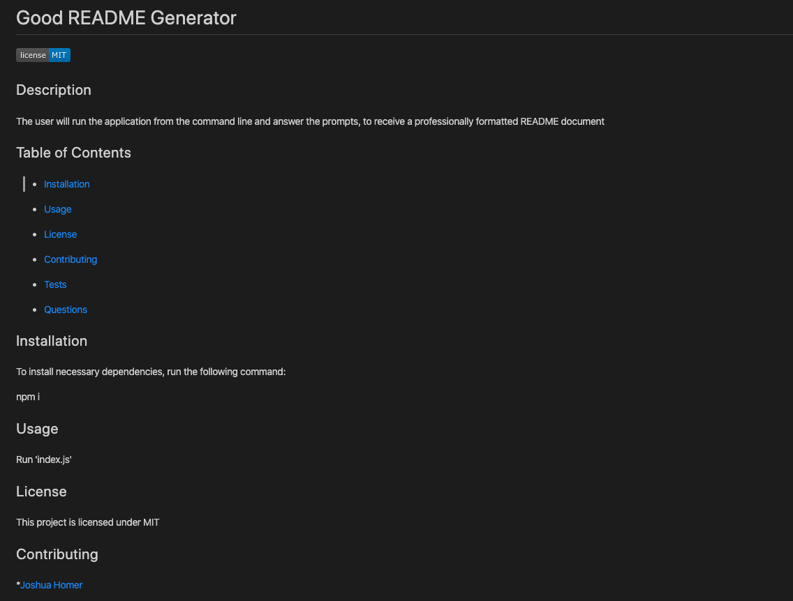

# Good README Generator

## About

Every project/assignment should be accompanied by a well structured README.md document, to explain the purpose as well as the finished product. To help developers quickly and efficiently generate a README for their project, I created a command-line application. 

In order to construct a README specifically designed to the user's project, the application will start by aquiring the necessary information regarding their project. Using node js and the Inquirer package, the user will immediately answer the prompted questions. 

I generated a markdown template to utilize the user's responses, and properly format the README document. The finished product needed to include: the title, a license badge, description of the project, table of contents, installation information, contributing information, testing information and links to user's email & GitHub profile - for any questions.

## Contributors

* [Joshua Homer](https://github.com/Jchomer90)

## Run 'index.js'

## Answer prompted questions

## Results

